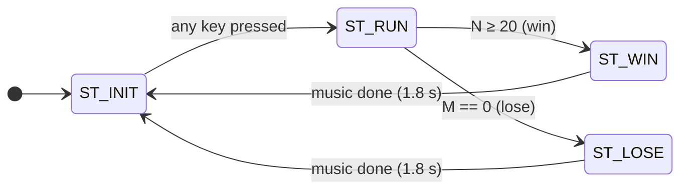

# Whack-a-Mole Game — SystemVerilog RTL Implementation

[中文文档 (Chinese documentation)](./readme_cn.md)

A complete, self-contained SystemVerilog RTL implementation of a classic **Whack-a-Mole** arcade game, designed for FPGA development boards with push buttons, LEDs, a 6-digit 7-segment display, and a buzzer.

**The classic game has been fully verified in hardware on a Xilinx Artix-7 FPGA** (`xc7a200tfbg484-2`, Vivado 2023.2): synthesized, placed, routed, and played on the board. The later-added hard mode is verified by a self-checking simulation testbench plus re-synthesis (see the verification section). Post-route timing, utilization, and power reports are included in the [`assets/`](./assets) folder.

---

## Repository Contents

| File | Description |
|------|-------------|
| `whach_a_mole.sv` | RTL source with **English** comments |
| `whach_a_mole_cn.sv` | Identical RTL source with the original **Chinese** comments |
| `README.md` | This document |
| `readme_cn.md` | Chinese version of this document |
| `assets/` | Post-implementation timing / utilization / power reports from Vivado |
| `LICENSE` | MIT license |

The two `.sv` files contain **byte-for-byte identical logic** — only the comment language differs. Use whichever you prefer; the top-level module in both is `whack_a_mole_game`.

---

## Game Rules

The game uses 4 push buttons (KEY4–KEY1), 4 LEDs (LED4–LED1), a 6-digit 7-segment display (SM6–SM1), and a buzzer.

### Initial state
- LED4–LED1 are **all lit** (full lives).
- SM6, SM5 show the cleared-mole count **N = 00**.
- SM4–SM1 are blank.
- Pressing **any** of KEY4–KEY1 starts the game.

### Running state
- **SM4–SM1** are the four mole holes. Each round (1 second), exactly one mole pops up at a pseudo-random position (two moles in hard mode — see below; the first mole appears one round after the start key is pressed):
  - **Small mole** (`u`-shaped pattern, bottom segments lit) — needs **1 hit** to clear.
  - **Big mole** (all segments lit, an `8` pattern) — needs **2 hits** to clear (first hit turns it into a small mole).
  - Empty holes stay blank.
- **KEY4–KEY1** map one-to-one to SM4–SM1. Pressing a key delivers one hit to that hole.
- **SM6, SM5** show the cleared count **N**, incremented each time a mole is fully cleared.
- **LED4–LED1** show the remaining chances **M** (initially 4). If a mole survives until the end of its round, it disappears by itself, **M decreases by 1**, one LED turns off, and the buzzer emits a short 500 Hz beep.
- **Win**: N reaches **20** → the buzzer plays a cheerful high tone (1 kHz) for 1.8 s, then the game returns to the initial state.
- **Lose**: M reaches **0** (all LEDs off) → the buzzer plays a sad low tone (200 Hz) for 1.8 s, then the game returns to the initial state.

### Hard mode

Driving the `hard_mode` input high (e.g. from a DIP switch) enables hard mode:

- Every round **two moles** pop up, always at two *different* holes.
- **At most one big mole** is ever on screen — the second mole of each pair is always small.
- Everything else is unchanged: one hit clears a small mole, two clear a big one, N grows once per cleared mole, and exactly one chance M is lost per round if *any* mole survives.

Tie `hard_mode` low for the classic single-mole game. The switch goes through a 2-flop synchronizer and takes effect from the next spawn.

---

## Top-Level Interface

```systemverilog
module whack_a_mole_game #(
    parameter int CLK_FREQ_HZ    = 50_000_000, // System clock frequency
    parameter bit KEY_ACTIVE_LOW = 1'b1,       // 1: keys read 0 when pressed
    parameter bit SEG_ACTIVE_LOW = 1'b1,       // 1: segment outputs are active-low
    parameter bit DIG_ACTIVE_LOW = 1'b0,       // 0: digit enables are active-high
    parameter int WIN_TARGET     = 20,         // Moles to clear to win
    parameter int MAX_CHANCE     = 4,          // Initial lives
    parameter int ROUND_TIME_MS  = 1000,       // Mole lifetime per round
    parameter int SCAN_FREQ_HZ   = 1000,       // Display scan rate
    parameter int SHORT_BEEP_MS  = 150,        // Chance-lost beep duration
    parameter int END_MUSIC_MS   = 1800        // End-of-game tone duration
)(
    input  logic       clk,     // System clock (50 MHz by default)
    input  logic       rst_n,   // Asynchronous active-low reset
    input  logic [3:0] key,     // 4 hit keys (KEY_ACTIVE_LOW selects polarity)
    input  logic       hard_mode, // 1: hard mode — two moles per round, at most one big

    output logic [3:0] led,     // Remaining-chances LEDs
    output logic [6:0] seg,     // 7-segment segments {a,b,c,d,e,f,g}
    output logic [5:0] dig,     // Digit enables, dig[0]=SM1 ... dig[5]=SM6
    output logic       buzzer   // Passive-buzzer square-wave output
);
```

Board-dependent properties — key/segment/digit polarity and game pacing — are parameters, so most porting is just a matter of changing parameters and pin constraints. Two 50 MHz assumptions are baked into the RTL, however: the three buzzer tone dividers are fixed literals, and `scan_div_cnt` is a fixed 16-bit counter, which limits `CLK_FREQ_HZ` to at most 65.535 MHz — see the porting notes below.

---

## Architecture

The design is a single module organized into clearly separated functional blocks, all in one clock domain (`clk`) with an asynchronous active-low reset:

```
              ┌─────────────────────────────────────────────────────┐
              │                 whack_a_mole_game                   │
              │                                                     │
 key[3:0] ───►│ 1-ms-sampled ──► edge      ┌──────────────┐         │
              │ 8-ms debounce    detector ─►│              │────────►│ led[3:0]
              │                             │  Game FSM +  │         │
              │ free-running ──────────────►│  scoreboard  │         │
              │ 8-bit LFSR                  │ (chances M,  │         │
              │                             │  kills N,    │  ┌────► │ seg[6:0]
              │ 1-ms tick ┬───► round timer─►│  mole HP×4) │──┤      │
              │ generator └───► scan index ─┼─────────────►│  └────► │ dig[5:0]
              │                             └──────┬───────┘         │
              │                    tone generator ◄┘ ───────────────►│ buzzer
              └─────────────────────────────────────────────────────┘
```

### 1. Timing backbone — 1 ms tick generator
A single divider derived from `CLK_FREQ_HZ / SCAN_FREQ_HZ` produces a 1 ms pulse (`tick_1ms`). This one tick drives both the display scan index and the key-sampling clock enable, so no additional clock domains are created — the whole design is strictly synchronous to `clk`.

### 2. Key debouncing — 8 ms shift-register qualification
Each of the 4 keys has an 8-bit shift register sampled once per millisecond. A key is accepted as *pressed* only after 8 consecutive 1-samples (`8'hFF`) and as *released* only after 8 consecutive 0-samples (`8'h00`). A one-cycle delayed copy of the stable state feeds a rising-edge detector, producing exactly **one single-clock hit pulse per physical press** (`key_press`), immune to both bounce and key-hold repetition. The `KEY_ACTIVE_LOW` parameter normalizes polarity before the shift register.

### 3. Pseudo-random mole generation — free-running LFSR
An 8-bit Fibonacci LFSR (taps 8, 6, 5, 4; seed `8'hA5`) runs at the full 50 MHz clock **continuously, including while the game idles in the start screen**. Because the number of clock cycles a human spends before pressing "start" is unpredictable at 50 MHz granularity, the LFSR state at game start is effectively a true-random seed — every playthrough gets a different mole sequence, without any dedicated entropy hardware.

When a round expires, `lfsr[1:0]` selects which of the 4 holes spawns the mole and `lfsr[3:2] == 2'b11` decides whether it is a big mole (25 % probability) or a small one (75 %). In hard mode a second hole opens at `spawn_pos1 ^ offset`, where the offset comes from `lfsr[5:4]` and is forced non-zero — XOR-ing with a non-zero value can never map a position onto itself, so the two moles are guaranteed to occupy different holes. The second mole is always small, which enforces the at-most-one-big-mole rule by construction.

### 4. Game FSM — 4 states

- `ST_INIT` — resets M, N, mole HP and all timers; displays `00`, all LEDs on; waits for any key.
- `ST_RUN` — the main game loop (hit judging, round timing, spawning).
- `ST_WIN` / `ST_LOSE` — hold for `END_MUSIC_MS` (1.8 s) while the buzzer plays the win/lose tone, then return to `ST_INIT`.

The FSM uses the standard two-process style: a sequential state register and a combinational next-state function.

### 5. Core game logic — HP-based mole model
Each hole carries a 2-bit **hit-point counter** (`mole_hp[i]`): `0` = empty, `1` = small mole, `2` = big mole. This single encoding elegantly unifies the rules:

- A hit on a hole with `hp > 0` decrements it; the decrement `1 → 0` is the "fully cleared" event that increments the score **N**. A big mole (`2`) therefore naturally requires two hits, and the first hit visually shrinks it to a small mole.
- In hard mode, two moles can be fully cleared in the very same clock cycle (two debounced key edges can land on the same 1 ms sampling tick), so the per-position kill events are summed combinationally (`kills_now`) and added to **N** in one shot — incrementing N inside the per-position loop would silently drop one of two simultaneous kills.
- On each 1-second round boundary: if **any** hole still has `hp > 0`, one chance **M** is deducted and a 150 ms beep is triggered; then a fresh mole is spawned from the LFSR (which also clears all other holes).
- Since spawn assignments are placed after hit assignments in the same `always_ff` block, SystemVerilog last-assignment-wins semantics give the round-boundary spawn correct priority on the rare cycle where both fire.

### 6. Display path — multiplexed 7-segment scan
The 6 digits are time-multiplexed at 1 kHz per digit (full refresh ~167 Hz, flicker-free). A combinational mux selects the current digit's value: BCD tens/ones of N for SM6/SM5, or a mole glyph for SM4–SM1 (`4'hA` → small-mole `u` pattern, `4'hB` → big-mole full-`8` pattern, `4'hF` → blank). A shared `function automatic` 7-segment decoder maps values to segments, and the `SEG_ACTIVE_LOW` / `DIG_ACTIVE_LOW` parameters adapt the outputs to common-anode or common-cathode hardware.

### 7. Buzzer — programmable square-wave tone generator
A single programmable divider produces a 50 % duty-cycle square wave whose period is selected by game context: **1 kHz** (win), **200 Hz** (lose), **500 Hz** (chance-lost short beep). The buzzer output is gated so it only sounds during the short beep or the end-of-game states. Note that the three divider values (`18'd50000`, `18'd250000`, `18'd100000`) are literals chosen for the 50 MHz clock — retune them if you change `CLK_FREQ_HZ`.

---

## Hardware Verification on Xilinx Artix-7

The design was synthesized and implemented with **Vivado 2023.2** targeting **`xc7a200tfbg484-2`** (Artix-7) at a 50 MHz system clock, and verified on the actual development board — game flow, hit detection, scoring, life deduction, display, and all three buzzer tones behave as specified.

The hard-mode feature was added after that board bring-up. It is verified by a self-checking xsim testbench that auto-plays the game — covering two-moles-per-round spawning, the at-most-one-big-mole invariant, simultaneous double-kill scoring, the exactly-one-chance-per-round rule, and the win/lose paths in both modes (194 checks, all passing) — plus a clean re-synthesis for the same part (0 errors / 0 critical warnings). The reports below correspond to the hardware-verified classic-mode build.

### Post-route timing (see [`assets/whack_a_mole_game_timing_summary_routed.rpt`](./assets/whack_a_mole_game_timing_summary_routed.rpt))

| Metric | Value |
|--------|-------|
| Clock constraint | 50 MHz (20.000 ns) |
| WNS (setup) | **+14.916 ns** |
| WHS (hold) | **+0.171 ns** |
| Failing endpoints | **0** — all user constraints met |

The +14.916 ns setup slack implies the logic itself would close timing at roughly ~196 MHz, i.e. the design has nearly 4× frequency headroom at the 50 MHz operating point.

### Post-place utilization (see [`assets/whack_a_mole_game_utilization_placed.rpt`](./assets/whack_a_mole_game_utilization_placed.rpt))

| Resource | Used | Available | Utilization |
|----------|------|-----------|-------------|
| Slice LUTs | 190 | 133,800 | 0.14 % |
| Slice Registers | 183 | 269,200 | 0.07 % |
| Bonded IOB | 24 | 285 | 8.42 % |
| BUFGCTRL | 1 | 32 | 3.13 % |
| Block RAM / DSP | 0 | — | 0 % |

The whole game fits in under 200 LUTs and 200 flip-flops with no BRAM or DSP usage, so it drops easily into any Artix-7 (or smaller 7-series) device as a demo or teaching design.

### Power (see [`assets/whack_a_mole_game_power_routed.rpt`](./assets/whack_a_mole_game_power_routed.rpt))

| Metric | Value |
|--------|-------|
| Total on-chip power | 0.149 W |
| Dynamic | 0.011 W |
| Static | 0.138 W |

---

## Porting / Using the Design

1. Add `whach_a_mole.sv` (or `whach_a_mole_cn.sv`) to your Vivado project and set `whack_a_mole_game` as the top module.
2. Write an XDC for your board: constrain `clk` to your oscillator pin with a matching `create_clock`, and assign `key[3:0]`, `led[3:0]`, `seg[6:0]`, `dig[5:0]`, `buzzer`, `rst_n`, and `hard_mode` (a DIP switch — or tie it low for the classic game) to the appropriate pins. If your keys are mechanical switches to GND, enable internal pull-ups (`set_property PULLUP TRUE`).
3. Adjust the parameters if your board differs from the reference setup:
   - `CLK_FREQ_HZ` — your actual clock frequency. The round / beep / music / scan time constants derive from it automatically, but two 50 MHz assumptions in the RTL need attention when you change it: the three buzzer tone dividers (`18'd50000/250000/100000`) are fixed literals and must be retuned to keep the 1 kHz / 200 Hz / 500 Hz tones, and the 16-bit `scan_div_cnt` counter limits `CLK_FREQ_HZ` to at most 65.535 MHz unless you widen it;
   - `KEY_ACTIVE_LOW` / `SEG_ACTIVE_LOW` / `DIG_ACTIVE_LOW` — polarity of your keys and display;
   - `WIN_TARGET`, `MAX_CHANCE`, `ROUND_TIME_MS` — game difficulty tuning.
4. Synthesize, implement, generate the bitstream, and play.

## License

This project is licensed under the [MIT License](./LICENSE) — free to use, modify, and distribute (in coursework, demos, and commercial projects alike), as long as the copyright notice is retained.
