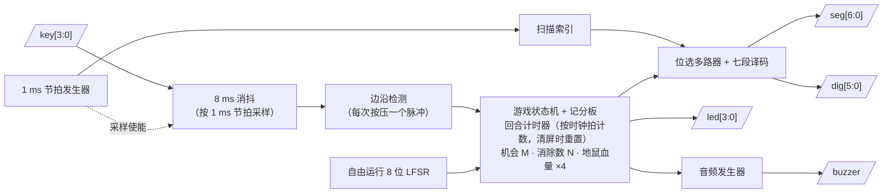
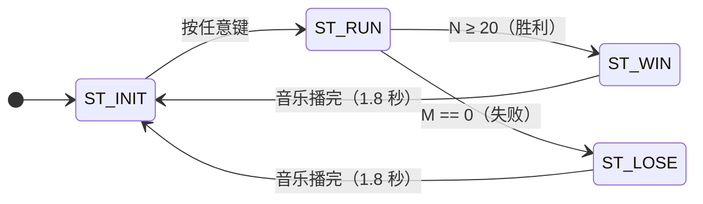

# 打地鼠游戏 — SystemVerilog RTL 实现

[English documentation (英文文档)](./README.md)

一个完整、独立的经典**打地鼠**街机游戏 SystemVerilog RTL 实现，面向带有按键、LED、6 位七段数码管和蜂鸣器的 FPGA 开发板。

**最初的经典版本已在 Xilinx Artix-7 FPGA 上完成完整的硬件验证**（`xc7a200tfbg484-2`，Vivado 2023.2）：综合、布局、布线全部通过，并在开发板上实际运行游戏验证；后续新增的困难模式与"清屏后重新计时"出鼠节奏经自检仿真与重新综合验证（见硬件验证一节）。布线后的时序、资源利用率和功耗报告见 [`assets/`](./assets) 文件夹。

---

## 仓库内容

| 文件 | 说明 |
|------|------|
| `whach_a_mole.sv` | **英文**注释版 RTL 源码 |
| `whach_a_mole_cn.sv` | 原始**中文**注释版 RTL 源码，逻辑完全相同 |
| `README.md` | 英文文档 |
| `readme_cn.md` | 本文档 |
| `assets/` | Vivado 实现后的时序 / 资源 / 功耗报告 |
| `LICENSE` | MIT 开源协议 |

两个 `.sv` 文件的**逻辑完全一致**，仅注释语言不同，任选其一即可；顶层模块均为 `whack_a_mole_game`。

---

## 游戏规则

游戏使用 4 个按键（KEY4~KEY1）、4 个 LED（LED4~LED1）、6 位七段数码管（SM6~SM1）和 1 个蜂鸣器。

### 初始状态
- LED4~LED1 **全亮**（满血）。
- SM6、SM5 显示消除个数 **N = 00**。
- SM4~SM1 全灭。
- 按 KEY4~KEY1 **任意键**开始游戏。

### 运行状态
- **SM4~SM1** 是四个地鼠洞。每一波恰好一只地鼠出现在伪随机位置，最多停留 1 秒（困难模式下为两只，见下文；第一波在按下开始键 1 秒后出现）：
  - **小地鼠**（`u` 形图案，点亮底部段）——需要打击 **1 下**才能消除。
  - **大地鼠**（全段点亮，即 `8` 字图案）——需要打击 **2 下**才能消除（第一下会把它打成小地鼠）。
  - 无地鼠的位置保持熄灭。
- **KEY4~KEY1** 与 SM4~SM1 一一对应，按下按键表示打击对应位置的地鼠 1 下。
- **SM6、SM5** 显示消除个数 **N**，每完全消除一只地鼠加 1。
- **LED4~LED1** 显示剩余机会次数 **M**（初始为 4）。若地鼠在本轮结束时仍未被消除，它会自己消失，**M 减 1**，熄灭一个 LED，同时蜂鸣器发出 500 Hz 短响。
- 出现节奏：1 秒回合计时器在**清屏时重新计时**——打完全部地鼠后，下一波恰好在最后一击的 1 秒后出现，保证有喘息时间；若有地鼠存活到回合结束，下一波则在到期时立即出现。
- **胜利**：N 达到 **20** → 蜂鸣器播放 1.8 秒欢快的高音（1 kHz），随后回到初始状态。
- **失败**：M 减到 **0**（LED 全灭）→ 蜂鸣器播放 1.8 秒伤心的低音（200 Hz），随后回到初始状态。

### 困难模式

将 `hard_mode` 输入拉高（例如接拨码开关）即启用困难模式：

- 每一轮**同时出现两只地鼠**，且位置必然不同。
- 屏幕上**至多只有一只大地鼠**——每对地鼠中的第二只固定为小地鼠。
- 其余规则完全不变：小地鼠打 1 下、大地鼠打 2 下，每完全消除一只 N 加 1，回合结束时只要还有任意地鼠存活就恰好扣 1 次机会。

将 `hard_mode` 拉低即为经典单只模式。该开关经过两级触发器同步，从下一次生成地鼠时生效。

---

## 顶层接口

```systemverilog
module whack_a_mole_game #(
    parameter int CLK_FREQ_HZ    = 50_000_000, // 系统时钟频率
    parameter bit KEY_ACTIVE_LOW = 1'b1,       // 1: 按键按下时读到 0
    parameter bit SEG_ACTIVE_LOW = 1'b1,       // 1: 段选低电平点亮
    parameter bit DIG_ACTIVE_LOW = 1'b0,       // 0: 位选高电平使能
    parameter int WIN_TARGET     = 20,         // 胜利需要消除的地鼠数
    parameter int MAX_CHANCE     = 4,          // 初始机会次数
    parameter int ROUND_TIME_MS  = 1000,       // 每轮地鼠停留时间
    parameter int SCAN_FREQ_HZ   = 1000,       // 数码管扫描频率
    parameter int SHORT_BEEP_MS  = 150,        // 扣血短响时长
    parameter int END_MUSIC_MS   = 1800        // 结束音乐时长
)(
    input  logic       clk,     // 系统时钟（默认 50 MHz）
    input  logic       rst_n,   // 异步低电平复位
    input  logic [3:0] key,     // 4 个打击按键（极性由 KEY_ACTIVE_LOW 选择）
    input  logic       hard_mode, // 1: 困难模式——每轮两只地鼠，至多一只大地鼠

    output logic [3:0] led,     // 剩余机会 LED
    output logic [6:0] seg,     // 七段数码管段选 {a,b,c,d,e,f,g}
    output logic [5:0] dig,     // 位选，dig[0]=SM1 ... dig[5]=SM6
    output logic       buzzer   // 无源蜂鸣器方波输出
);
```

与开发板相关的属性——按键/段选/位选极性、游戏节奏——均已参数化，移植到其它开发板大多只需修改参数和引脚约束。但 RTL 中有两处隐含的 50 MHz 假设：三个蜂鸣器音调分频值是固定字面量，且 `scan_div_cnt` 是固定 16 位计数器（将 `CLK_FREQ_HZ` 上限限制在 65.535 MHz），详见下文移植说明。

---

## 架构设计

设计为单一模块，内部划分为界限清晰的功能块，全部工作在同一个时钟域（`clk`），采用异步低电平复位：



### 1. 时序基础 — 1 ms 节拍发生器
由 `CLK_FREQ_HZ / SCAN_FREQ_HZ` 导出的单个分频器产生 1 ms 脉冲（`tick_1ms`）。这一个节拍同时驱动数码管扫描索引和按键采样使能，不产生任何额外时钟域——整个设计严格同步于 `clk`。

### 2. 按键消抖 — 8 ms 移位寄存器判定
4 个按键各配一个 8 位移位寄存器，每毫秒采样一次。只有连续 8 次采样全为 1（`8'hFF`）才判定为*按下*，连续 8 次全为 0（`8'h00`）才判定为*松开*。稳定状态打一拍后做上升沿检测，使**每次物理按压恰好产生一个单时钟周期的打击脉冲**（`key_press`），既不受抖动影响，也不会因长按而重复触发。`KEY_ACTIVE_LOW` 参数在移位寄存器之前完成极性归一化。

### 3. 伪随机地鼠生成 — 自由运行的 LFSR
一个 8 位斐波那契 LFSR（抽头 8、6、5、4，种子 `8'hA5`）以 50 MHz 全速**持续运转，包括游戏停留在开始画面期间**。由于玩家按下"开始"之前经过的时钟周期数在 50 MHz 粒度下不可预测，游戏开始时的 LFSR 状态实际上等效于真随机种子——每局游戏的地鼠序列都不相同，且无需任何专门的熵源硬件。

每轮结束时，`lfsr[1:0]` 决定地鼠出现在 4 个洞中的哪一个，`lfsr[3:2] == 2'b11` 决定是大地鼠（25% 概率）还是小地鼠（75% 概率）。困难模式下会再打开第二个洞，位置为 `spawn_pos1 ^ offset`，偏移量取自 `lfsr[5:4]` 并强制非零——与非零值异或不可能映射回原位置，因此两只地鼠必然位于不同的洞。第二只固定为小地鼠，从构造上保证了"至多一只大地鼠"的规则。

### 4. 游戏状态机 — 4 个状态

- `ST_INIT` —— 复位 M、N、地鼠血量和所有计时器；显示 `00`，LED 全亮；等待任意按键。
- `ST_RUN` —— 游戏主循环（打击判定、回合计时、生成地鼠）。
- `ST_WIN` / `ST_LOSE` —— 保持 `END_MUSIC_MS`（1.8 秒），蜂鸣器播放胜利/失败音，然后返回 `ST_INIT`。

状态机采用标准两段式：时序状态寄存器 + 组合次态函数。

### 5. 游戏核心逻辑 — 基于血量的地鼠模型
每个洞携带一个 2 位**血量计数器**（`mole_hp[i]`）：`0` = 无地鼠，`1` = 小地鼠，`2` = 大地鼠。这一编码优雅地统一了游戏规则：

- 打击 `hp > 0` 的洞使其血量减 1；`1 → 0` 的递减即"完全消除"事件，使分数 **N** 加 1。大地鼠（`2`）因此天然需要两次打击，且第一击在视觉上把它变成小地鼠。
- 困难模式下两只地鼠可能在同一个时钟周期内被同时消除（两个按键的消抖边沿可能落在同一个 1 ms 采样节拍上），因此各位置的消除事件先用组合逻辑求和（`kills_now`）再一次性累加到 **N**——若在逐位置循环内直接对 N 自增，两个同时发生的消除会被丢掉一个。
- 回合到期时：若在*本拍打击结算后*仍有地鼠存活（`any_alive_next`——恰在到期那一拍完成的击杀绝不会被误扣机会），扣除一次机会 **M** 并触发 150 ms 短响；随后由 LFSR 生成新一波地鼠（同时清空其它洞）。
- 玩家在回合中途清空全部地鼠时（`board_cleared_now`），回合计时器重新计时，下一波在最后一击的一个完整回合后出现，而不是按固定的全局节拍——0.9 秒时打死地鼠不再意味着 0.1 秒后就要面对新地鼠。
- 由于生成逻辑在同一个 `always_ff` 块中位于打击逻辑之后，SystemVerilog 的"最后赋值生效"语义保证了在两者同时发生的罕见周期里，回合边界的生成逻辑具有正确的优先级。

### 6. 显示通路 — 动态扫描七段数码管
6 位数码管以每位 1 kHz 时分复用（整屏刷新率约 167 Hz，无闪烁）。组合多路选择器决定当前位的显示内容：SM6/SM5 显示 N 的 BCD 十位/个位，SM4~SM1 显示地鼠图案（`4'hA` → 小地鼠 `u` 图案，`4'hB` → 大地鼠全亮 `8` 图案，`4'hF` → 熄灭）。共享的 `function automatic` 七段译码器完成数值到段码的映射，`SEG_ACTIVE_LOW` / `DIG_ACTIVE_LOW` 参数适配共阳/共阴硬件。

### 7. 蜂鸣器 — 可编程方波音频发生器
单个可编程分频器产生 50% 占空比方波，周期由游戏状态选择：**1 kHz**（胜利）、**200 Hz**（失败）、**500 Hz**（扣血短响）。蜂鸣器输出经过门控，仅在短响或游戏结束状态期间发声。注意：三个分频值（`18'd50000`、`18'd250000`、`18'd100000`）是针对 50 MHz 时钟选取的字面量——若修改 `CLK_FREQ_HZ`，需要相应重新调整。

---

## Xilinx Artix-7 硬件验证

本设计使用 **Vivado 2023.2**，目标器件 **`xc7a200tfbg484-2`**（Artix-7），系统时钟 50 MHz，完成综合与实现，并在实际开发板上验证通过——游戏流程、打击判定、计分、扣血、显示以及三种蜂鸣器音效全部符合规格。

困难模式与"清屏后重新计时"出鼠节奏是板级验证之后新增的功能，通过一个自动打地鼠的 xsim 自检仿真平台验证——覆盖每轮双地鼠生成、至多一只大地鼠不变量、同拍双杀计分、每次清屏后计时器重置与喘息期内场上无地鼠、每轮恰扣一次机会规则以及两种模式下的胜利/失败路径（共 250 项检查全部通过），并对同型号器件重新综合通过（0 error / 0 critical warning）。下方报告对应经过硬件验证的最初版本。

### 布线后时序（见 [`assets/whack_a_mole_game_timing_summary_routed.rpt`](./assets/whack_a_mole_game_timing_summary_routed.rpt)）

| 指标 | 数值 |
|------|------|
| 时钟约束 | 50 MHz（20.000 ns） |
| WNS（建立） | **+14.916 ns** |
| WHS（保持） | **+0.171 ns** |
| 违例端点 | **0** —— 所有用户约束全部满足 |

+14.916 ns 的建立余量意味着该逻辑本身可以在约 196 MHz 下收敛时序，即在 50 MHz 工作点上有接近 4 倍的频率裕量。

### 布局后资源利用率（见 [`assets/whack_a_mole_game_utilization_placed.rpt`](./assets/whack_a_mole_game_utilization_placed.rpt)）

| 资源 | 使用 | 可用 | 利用率 |
|------|------|------|--------|
| Slice LUT | 190 | 133,800 | 0.14 % |
| Slice 寄存器 | 183 | 269,200 | 0.07 % |
| Bonded IOB | 24 | 285 | 8.42 % |
| BUFGCTRL | 1 | 32 | 3.13 % |
| Block RAM / DSP | 0 | — | 0 % |

整个游戏只占用不到 200 个 LUT 和 200 个触发器，不使用任何 BRAM 或 DSP，可以轻松放进任意 Artix-7（或更小的 7 系列）器件，作为演示或教学设计。

### 功耗（见 [`assets/whack_a_mole_game_power_routed.rpt`](./assets/whack_a_mole_game_power_routed.rpt)）

| 指标 | 数值 |
|------|------|
| 片上总功耗 | 0.149 W |
| 动态功耗 | 0.011 W |
| 静态功耗 | 0.138 W |

---

## 移植 / 使用方法

1. 将 `whach_a_mole.sv`（或 `whach_a_mole_cn.sv`）加入你的 Vivado 工程，并把 `whack_a_mole_game` 设为顶层模块。
2. 为你的开发板编写 XDC：用匹配的 `create_clock` 将 `clk` 约束到晶振引脚，并把 `key[3:0]`、`led[3:0]`、`seg[6:0]`、`dig[5:0]`、`buzzer`、`rst_n`、`hard_mode`（接拨码开关，经典玩法可直接接低电平）分配到相应引脚。若按键是接地的机械开关，需启用内部上拉（`set_property PULLUP TRUE`）。
3. 若你的开发板与参考配置不同，调整参数：
   - `CLK_FREQ_HZ` —— 实际时钟频率。回合/短响/音乐/扫描等时间常数会自动由它导出，但修改时需注意 RTL 中两处 50 MHz 假设：三个蜂鸣器音调分频值（`18'd50000/250000/100000`）是固定字面量，更换时钟后需重新调整以保持 1 kHz / 200 Hz / 500 Hz 音调；16 位 `scan_div_cnt` 计数器将 `CLK_FREQ_HZ` 上限限制在 65.535 MHz，超出需加宽该计数器；
   - `KEY_ACTIVE_LOW` / `SEG_ACTIVE_LOW` / `DIG_ACTIVE_LOW` —— 按键与数码管极性；
   - `WIN_TARGET`、`MAX_CHANCE`、`ROUND_TIME_MS` —— 游戏难度调节。
4. 综合、实现、生成比特流，开始游戏。

## 许可

本项目采用 [MIT 协议](./LICENSE) 开源——可自由使用、修改和分发（课程作业、演示乃至商业项目均可），只需保留版权声明。
